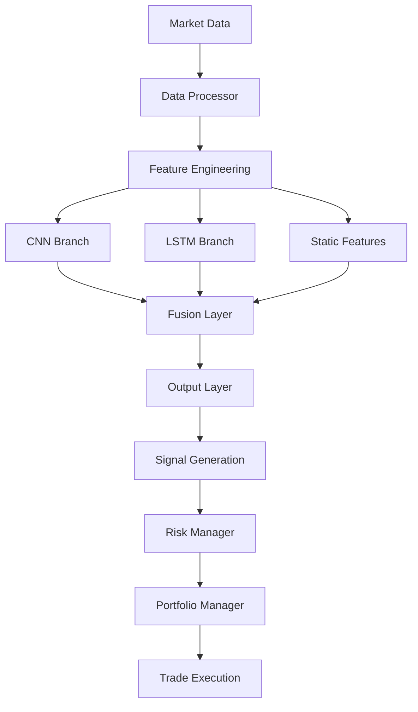

# Unified CNN-LSTM Trading Bot

A comprehensive, production-ready algorithmic trading system that combines Convolutional Neural Networks (CNN) and Long Short-Term Memory (LSTM) networks for advanced pattern recognition and sequence modeling in financial markets.

[](https://www.python.org/downloads/)
[](https://tensorflow.org/)
[](LICENSE)
[](https://github.com/psf/black)

## 🚀 Features

### 🧠 Advanced AI Architecture
- **Unified CNN-LSTM Hybrid Model**: Combines pattern recognition with sequence modeling
- **Multi-Scale Convolutions**: 3, 5, and 7 kernel sizes for diverse pattern detection
- **Bidirectional LSTM**: Captures forward and backward temporal dependencies
- **Multi-Head Attention**: Advanced attention mechanism for sequence processing
- **Static Feature Integration**: Time-based and market regime features

### 📊 Comprehensive Technical Analysis
- **150+ Technical Indicators**: RSI, MACD, Bollinger Bands, ATR, Stochastic, Williams %R, and more
- **Multi-Timeframe Analysis**: 1min, 5min, 15min, 1h, 1d data integration
- **Pattern Recognition**: Candlestick patterns, support/resistance levels
- **Market Structure Analysis**: Trend strength, volatility clustering
- **Volume Analysis**: OBV, VWAP, Money Flow Index, and volume-based indicators

### 🔄 Real-Time Trading Capabilities
- **Interactive Brokers Integration**: Live market data and trade execution
- **Paper Trading Support**: Risk-free testing environment
- **Multi-Symbol Trading**: Portfolio diversification across multiple assets
- **Automated Execution**: Schedule-based trading with configurable intervals
- **Real-Time Monitoring**: Live portfolio tracking and performance metrics

### 🛡️ Advanced Risk Management
- **Position Sizing**: Kelly Criterion, fixed fractional, volatility-based sizing
- **Drawdown Control**: Maximum drawdown limits with automatic halt
- **Stop Loss & Take Profit**: Configurable risk/reward ratios
- **Confidence Filtering**: Minimum confidence thresholds for trade execution
- **Correlation Analysis**: Avoid over-concentration in correlated assets

### 📈 Performance Analytics
- **Comprehensive Backtesting**: Historical performance evaluation
- **Real-Time Metrics**: Sharpe ratio, maximum drawdown, win rate
- **Equity Curve Tracking**: Portfolio value over time
- **Trade Analysis**: Individual trade performance and statistics
- **Risk Metrics**: VaR, volatility, correlation analysis

## 🏗️ Architecture Overview



### Core Components

1. **DataProcessor**: Fetches market data and calculates 150+ technical indicators
2. **ModelBuilder**: Implements the unified CNN-LSTM architecture
3. **UnifiedTradingBot**: Main orchestration with automated trading capabilities
4. **PortfolioManager**: Manages positions, trades, and performance tracking
5. **RiskManager**: Implements position sizing and risk controls

## 🚀 Quick Start

### Installation

```bash
# Clone the repository
git clone https://github.com/Visharath/TradingBot.git
cd TradingBot

# Install dependencies
pip install -r requirements.txt

# Or install in development mode
pip install -e .
```

### Basic Usage

```python
from src.unified_trading_bot import UnifiedTradingBot
from src.config import Config

# Initialize the trading bot
config = Config()
bot = UnifiedTradingBot()

# Train the model
metrics = bot.train_model(symbols=['AAPL', 'GOOGL', 'MSFT'])
print(f"Training accuracy: {metrics['val_accuracy']:.4f}")

# Generate predictions
predictions = bot.predict_signals(['AAPL'])
print(predictions)

# Start automated trading (paper trading by default)
bot.start_automated_trading(interval_minutes=60)
```

### Command Line Interface

```bash
# Train the model
python -m src.unified_trading_bot --train --symbols AAPL GOOGL MSFT

# Generate predictions
python -m src.unified_trading_bot --predict --symbols AAPL

# Start automated trading
python -m src.unified_trading_bot --trade

# Run backtesting
python -m src.unified_trading_bot --backtest --symbols AAPL GOOGL
```

## 📖 Documentation

### Configuration

The system uses a comprehensive configuration system with dataclasses:

```python
from src.config import Config

config = Config()

# Model configuration
config.model.sequence_length = 60
config.model.batch_size = 32
config.model.learning_rate = 0.001

# Trading configuration
config.trading.initial_capital = 100000
config.trading.max_position_size = 0.1
config.trading.paper_trading = True

# Data configuration
config.data.symbols = ['AAPL', 'GOOGL', 'MSFT']
config.data.lookback_days = 252
```

### Environment Variables

```bash
# Interactive Brokers settings
export IB_HOST="127.0.0.1"
export IB_PORT="7497"
export IB_ACCOUNT_ID="your_account_id"
export PAPER_TRADING="true"

# Logging and monitoring
export LOG_LEVEL="INFO"
export WANDB_PROJECT="trading-bot"
export ENVIRONMENT="production"
```

### Technical Indicators

The system calculates 150+ technical indicators organized into categories:

#### Trend Indicators
- Simple Moving Averages (SMA): 5, 10, 20, 50, 100, 200 periods
- Exponential Moving Averages (EMA): Multiple periods
- MACD: Signal line, histogram, crossovers
- ADX: Trend strength measurement
- Aroon: Trend identification
- CCI: Commodity Channel Index

#### Momentum Indicators
- RSI: 14, 21, 30 period Relative Strength Index
- Stochastic Oscillator: %K and %D lines
- Williams %R: Momentum indicator
- Rate of Change (ROC): Multiple periods
- True Strength Index (TSI)
- Ultimate Oscillator

#### Volatility Indicators
- Bollinger Bands: Upper, middle, lower bands with width and position
- Average True Range (ATR): 14, 21 period volatility
- Keltner Channels: Volatility-based channels
- Donchian Channels: Breakout identification
- Historical Volatility: Multiple lookback periods

#### Volume Indicators
- On Balance Volume (OBV): Volume-price relationship
- Volume Price Trend (VPT): Volume momentum
- Money Flow Index (MFI): Volume-weighted RSI
- Accumulation/Distribution Index: Volume flow
- Chaikin Money Flow: Money flow oscillator
- Volume Weighted Average Price (VWAP)

### Model Architecture Details

#### CNN Branch
- **Multi-Scale Convolutions**: Kernel sizes of 3, 5, and 7 for different pattern scales
- **Batch Normalization**: Improved training stability
- **Max Pooling**: Dimensionality reduction
- **Dropout**: Regularization to prevent overfitting

#### LSTM Branch
- **Bidirectional LSTM**: Captures both forward and backward dependencies
- **Layer Normalization**: Stabilizes deep network training
- **Multi-Head Attention**: Advanced sequence modeling
- **Residual Connections**: Improves gradient flow

#### Fusion Layer
- **Feature Concatenation**: Combines CNN, LSTM, and static features
- **Dense Layers**: 256 → 128 → 64 neurons with regularization
- **Batch Normalization**: Improved convergence
- **Dropout**: Prevents overfitting in fusion stage

## 📊 Performance Metrics

### Backtesting Results (Example)

```
Symbol: AAPL (2023-01-01 to 2023-12-31)
Total Return: 24.8%
Max Drawdown: 8.2%
Sharpe Ratio: 1.67
Win Rate: 62.3%
Total Trades: 156
Avg Trade Duration: 4.2 days
```

### Real-Time Monitoring

The system provides comprehensive real-time monitoring:

- Portfolio value and returns
- Open positions and unrealized P&L
- Trade execution history
- Risk metrics and alerts
- Model confidence scores
- System health and error tracking

## 🔧 Advanced Configuration

### Custom Indicators

```python
from src.data_processor import DataProcessor

class CustomDataProcessor(DataProcessor):
    def _add_custom_indicators(self, df):
        # Add your custom technical indicators
        df['custom_indicator'] = your_custom_calculation(df)
        return df
```

### Model Customization

```python
from src.model_builder import ModelBuilder

# Customize model architecture
config.model.cnn_filters = [64, 128, 256]
config.model.lstm_units = [150, 75]
config.model.attention_heads = 12
config.model.dropout_rate = 0.4
```

### Risk Management Rules

```python
# Custom risk management
config.trading.max_position_size = 0.05  # 5% per position
config.trading.max_drawdown = 0.10       # 10% maximum drawdown
config.trading.stop_loss_pct = 0.03      # 3% stop loss
config.trading.take_profit_pct = 0.06    # 6% take profit
config.trading.min_confidence = 0.7      # 70% minimum confidence
```

## 🧪 Testing

### Running Tests

```bash
# Run all tests
pytest tests/

# Run with coverage
pytest tests/ --cov=src --cov-report=html

# Run specific test file
pytest tests/test_data_processor.py -v
```

### Example Test

```python
def test_data_processor():
    config = Config()
    processor = DataProcessor(config)
    
    # Test data fetching
    data = processor.fetch_data('AAPL', period='1y')
    assert data is not None
    assert len(data) > 100
    
    # Test indicator calculation
    data_with_indicators = processor.calculate_technical_indicators(data)
    assert 'rsi_14' in data_with_indicators.columns
    assert 'macd' in data_with_indicators.columns
```

## 🤝 Contributing

We welcome contributions! Please see [CONTRIBUTING.md](CONTRIBUTING.md) for guidelines.

### Development Setup

```bash
# Install development dependencies
pip install -e ".[dev]"

# Install pre-commit hooks
pre-commit install

# Run code formatting
black src/ tests/
isort src/ tests/

# Run linting
flake8 src/ tests/
mypy src/
```

## 📝 License

This project is licensed under the MIT License - see the [LICENSE](LICENSE) file for details.

## ⚠️ Disclaimer

This software is for educational and research purposes only. Trading financial instruments involves substantial risk of loss and is not suitable for all investors. Past performance is not indicative of future results. The authors and contributors are not responsible for any financial losses incurred through the use of this software.

Always:
- Start with paper trading
- Thoroughly backtest strategies
- Understand the risks involved
- Never invest more than you can afford to lose
- Consult with financial advisors

## 🆘 Support

- **Documentation**: [docs/](docs/)
- **Issues**: [GitHub Issues](https://github.com/Visharath/TradingBot/issues)
- **Discussions**: [GitHub Discussions](https://github.com/Visharath/TradingBot/discussions)

## 🏆 Acknowledgments

- TensorFlow team for the deep learning framework
- The TA-Lib developers for technical analysis functions
- Interactive Brokers for their comprehensive API
- The open-source community for various libraries and tools

---

**Built with ❤️ by [Visharath](https://github.com/Visharath)**