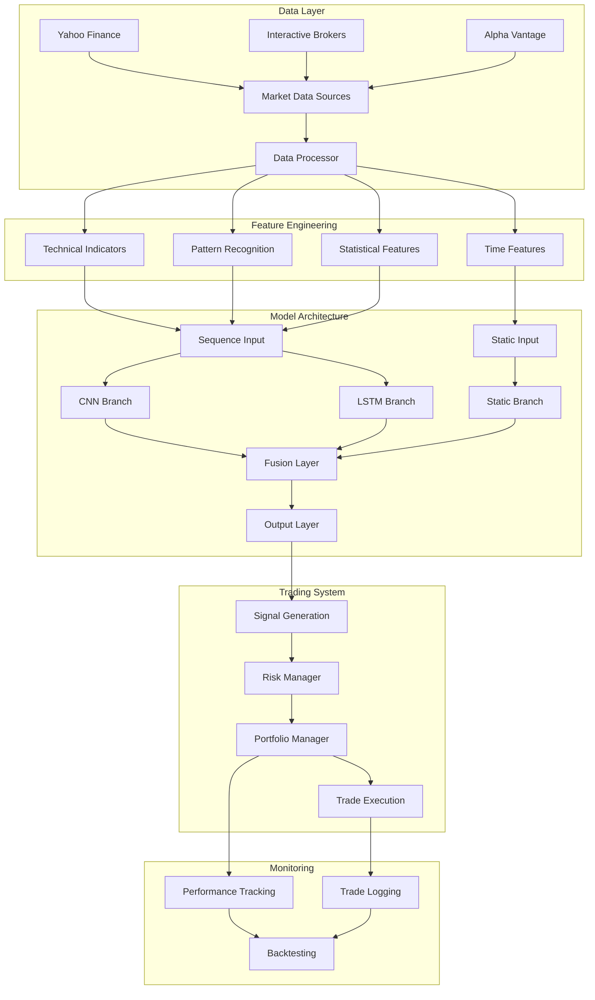

# Architecture Guide

## Overview

The Unified CNN-LSTM Trading Bot employs a sophisticated hybrid architecture that combines the strengths of Convolutional Neural Networks (CNN) for pattern recognition and Long Short-Term Memory (LSTM) networks for sequence modeling. This document provides a detailed explanation of the system architecture, design decisions, and implementation details.

## System Architecture



## Core Components

### 1. Data Processing Pipeline

#### DataProcessor Class
The `DataProcessor` is responsible for:
- **Data Acquisition**: Fetching real-time and historical market data
- **Feature Engineering**: Calculating 150+ technical indicators
- **Data Validation**: Ensuring data quality and consistency
- **Preprocessing**: Scaling, normalization, and sequence creation

```python
class DataProcessor:
    def __init__(self, config: Config):
        self.config = config
        self.cache_dir = config.system.data_dir / "cache"
    
    def fetch_data(self, symbol: str, period: str, interval: str) -> pd.DataFrame:
        # Multi-source data fetching with caching
        pass
    
    def calculate_technical_indicators(self, data: pd.DataFrame) -> pd.DataFrame:
        # 150+ technical indicators calculation
        pass
```

#### Feature Categories

1. **Price-based Features** (15 indicators)
   - OHLC variations (HL2, HLC3, OHLC4)
   - Price changes and returns
   - Gap analysis

2. **Trend Indicators** (30 indicators)
   - Moving averages (SMA, EMA) with multiple periods
   - MACD family (MACD, Signal, Histogram)
   - Directional indicators (ADX, Aroon, CCI, DPO)

3. **Momentum Indicators** (25 indicators)
   - RSI with multiple periods
   - Stochastic oscillators
   - Williams %R, ROC, TSI, Ultimate Oscillator
   - Money Flow Index

4. **Volatility Indicators** (20 indicators)
   - Bollinger Bands (multiple periods)
   - Average True Range
   - Keltner and Donchian Channels
   - Historical volatility

5. **Volume Indicators** (15 indicators)
   - OBV, VPT, A/D Index
   - Chaikin Money Flow
   - Force Index, Ease of Movement
   - VWAP and volume ratios

6. **Statistical Features** (25 indicators)
   - Rolling statistics (mean, std, skew, kurtosis)
   - Z-scores and price positions
   - Statistical relationships

7. **Pattern Recognition** (10 indicators)
   - Candlestick patterns (Doji, Hammer, Engulfing)
   - Bar patterns (Inside, Outside)
   - Price action signals

8. **Market Structure** (15 indicators)
   - Support and resistance levels
   - Higher highs/lower lows
   - Trend strength measurements

### 2. Model Architecture

#### Unified CNN-LSTM Hybrid

The model architecture consists of three main branches that process different types of features:

##### CNN Branch: Pattern Recognition

```python
def build_cnn_branch(sequence_input):
    cnn_outputs = []
    
    for filters, kernel_size in zip(cnn_filters, cnn_kernel_sizes):
        # Multi-scale convolutions
        conv = Conv1D(
            filters=filters,
            kernel_size=kernel_size,
            activation='relu',
            padding='same'
        )(sequence_input)
        
        # Batch normalization and pooling
        conv = BatchNormalization()(conv)
        conv = MaxPooling1D(pool_size=2)(conv)
        conv = Dropout(dropout_rate)(conv)
        
        cnn_outputs.append(conv)
    
    # Combine multi-scale features
    cnn_combined = Concatenate()(cnn_outputs)
    return GlobalAveragePooling1D()(cnn_combined)
```

**Key Features:**
- **Multi-scale convolutions**: Kernel sizes of 3, 5, and 7 capture patterns at different scales
- **Batch normalization**: Improves training stability and convergence
- **Max pooling**: Reduces dimensionality while preserving important features
- **Global average pooling**: Converts variable-length sequences to fixed-size features

##### LSTM Branch: Sequence Modeling

```python
def build_lstm_branch(sequence_input):
    lstm_input = sequence_input
    
    # Stacked bidirectional LSTM layers
    for i, units in enumerate(lstm_units):
        return_sequences = i < len(lstm_units) - 1
        
        lstm_input = Bidirectional(
            LSTM(
                units,
                return_sequences=return_sequences,
                dropout=dropout_rate,
                recurrent_dropout=dropout_rate
            )
        )(lstm_input)
        
        if return_sequences:
            lstm_input = LayerNormalization()(lstm_input)
    
    # Multi-head attention mechanism
    if len(lstm_units) > 1:
        attention_output = MultiHeadAttention(
            num_heads=attention_heads,
            key_dim=lstm_units[-1]
        )(lstm_input, lstm_input)
        
        return GlobalAveragePooling1D()(attention_output)
    
    return lstm_input
```

**Key Features:**
- **Bidirectional processing**: Captures both forward and backward temporal dependencies
- **Stacked architecture**: Multiple layers for complex pattern learning
- **Layer normalization**: Stabilizes training in deep networks
- **Multi-head attention**: Advanced sequence modeling capabilities
- **Dropout regularization**: Prevents overfitting

##### Static Branch: Non-Sequential Features

```python
def build_static_branch(static_input):
    # Process time-based and market regime features
    static = Dense(64, activation='relu')(static_input)
    static = BatchNormalization()(static)
    static = Dropout(dropout_rate)(static)
    
    static = Dense(32, activation='relu')(static)
    static = BatchNormalization()(static)
    static = Dropout(dropout_rate)(static)
    
    return static
```

**Features Processed:**
- Time-based features (hour, day of week, month)
- Market session indicators
- Cyclic time encoding (sin/cos transformations)

##### Fusion Layer: Feature Integration

```python
def build_fusion_layer(cnn_features, lstm_features, static_features):
    # Combine all feature branches
    fusion_input = Concatenate()([
        cnn_features,
        lstm_features,
        static_features
    ])
    
    # Progressive dimensionality reduction
    fusion = Dense(256, activation='relu')(fusion_input)
    fusion = BatchNormalization()(fusion)
    fusion = Dropout(dropout_rate)(fusion)
    
    fusion = Dense(128, activation='relu')(fusion)
    fusion = BatchNormalization()(fusion)
    fusion = Dropout(dropout_rate)(fusion)
    
    fusion = Dense(64, activation='relu')(fusion)
    fusion = BatchNormalization()(fusion)
    fusion = Dropout(dropout_rate)(fusion)
    
    return fusion
```

**Design Principles:**
- **Feature concatenation**: Preserves all information from different branches
- **Progressive reduction**: Gradually reduces dimensionality
- **Regularization**: Batch normalization and dropout prevent overfitting
- **Non-linear combinations**: ReLU activations enable complex feature interactions

#### Output Layer and Loss Function

```python
def build_output_layer(fusion_features, n_classes):
    if n_classes == 2:
        # Binary classification (Buy/Sell)
        output = Dense(1, activation='sigmoid')(fusion_features)
        loss = 'binary_crossentropy'
    else:
        # Multi-class classification (Buy/Hold/Sell)
        output = Dense(n_classes, activation='softmax')(fusion_features)
        loss = 'sparse_categorical_crossentropy'
    
    return output, loss
```

### 3. Trading System Architecture

#### Risk Management System

```python
class RiskManager:
    def __init__(self, config: Config):
        self.max_position_size = config.trading.max_position_size
        self.max_drawdown = config.trading.max_drawdown
        self.stop_loss_pct = config.trading.stop_loss_pct
        self.take_profit_pct = config.trading.take_profit_pct
    
    def calculate_position_size(self, portfolio_value, price, confidence, volatility):
        # Kelly Criterion with confidence adjustment
        base_size = portfolio_value * self.max_position_size
        confidence_multiplier = confidence / 1.0
        volatility_multiplier = min(1.0, 0.02 / max(volatility, 0.01))
        
        return int((base_size * confidence_multiplier * volatility_multiplier) / price)
```

#### Portfolio Management System

```python
class PortfolioManager:
    def __init__(self, initial_capital, max_positions):
        self.current_capital = initial_capital
        self.positions = {}
        self.trade_history = []
        self.equity_curve = []
    
    def add_position(self, symbol, action, price, quantity, confidence, timestamp):
        # Position management with P&L tracking
        pass
    
    def get_performance_metrics(self):
        # Calculate comprehensive performance metrics
        return {
            'total_return_pct': total_return,
            'max_drawdown_pct': max_drawdown,
            'sharpe_ratio': sharpe_ratio,
            'win_rate_pct': win_rate
        }
```

### 4. Data Flow Architecture

#### Training Pipeline

1. **Data Collection**
   ```
   Market Data → Data Processor → Feature Engineering → Scaling
   ```

2. **Model Training**
   ```
   Scaled Features → Sequence Creation → Model Training → Validation
   ```

3. **Model Evaluation**
   ```
   Trained Model → Backtesting → Performance Metrics → Model Selection
   ```

#### Inference Pipeline

1. **Real-time Data Processing**
   ```
   Live Data → Feature Calculation → Scaling → Sequence Preparation
   ```

2. **Prediction Generation**
   ```
   Prepared Sequences → Model Inference → Signal Generation → Confidence Scoring
   ```

3. **Trade Execution**
   ```
   Signals → Risk Assessment → Position Sizing → Order Execution
   ```

## Design Patterns and Principles

### 1. Configuration Management

- **Dataclass-based Configuration**: Type-safe configuration with automatic validation
- **Environment Variable Integration**: Secure handling of sensitive parameters
- **Hierarchical Structure**: Organized configuration by component (model, data, trading, system)

### 2. Error Handling and Logging

```python
from loguru import logger

# Structured logging with context
logger.add(
    "logs/trading_bot.log",
    level="INFO",
    format="{time:YYYY-MM-DD HH:mm:ss} | {level} | {name}:{function}:{line} | {message}",
    rotation="1 day",
    retention="30 days"
)
```

### 3. Caching Strategy

- **Multi-level Caching**: Memory, disk, and database caching
- **TTL-based Invalidation**: Automatic cache refresh based on data age
- **Selective Caching**: Cache expensive operations (indicator calculations, model predictions)

### 4. Scalability Considerations

#### Horizontal Scaling
- **Multi-symbol Processing**: Parallel processing of multiple assets
- **Distributed Training**: Support for distributed model training
- **Microservices Architecture**: Modular components for easy scaling

#### Vertical Scaling
- **Memory Optimization**: Efficient data structures and processing
- **GPU Acceleration**: CUDA support for model training and inference
- **Parallel Processing**: Multi-threading for I/O operations

## Performance Optimizations

### 1. Model Optimizations

```python
# Mixed precision training
policy = tf.keras.mixed_precision.Policy('mixed_float16')
tf.keras.mixed_precision.set_global_policy(policy)

# Gradient accumulation for large batch sizes
@tf.function
def train_step(x, y):
    with tf.GradientTape() as tape:
        predictions = model(x, training=True)
        loss = loss_fn(y, predictions)
        scaled_loss = optimizer.get_scaled_loss(loss)
    
    scaled_gradients = tape.gradient(scaled_loss, model.trainable_variables)
    gradients = optimizer.get_unscaled_gradients(scaled_gradients)
    optimizer.apply_gradients(zip(gradients, model.trainable_variables))
    
    return loss
```

### 2. Data Processing Optimizations

```python
# Vectorized operations
def calculate_rsi_vectorized(prices, period=14):
    delta = prices.diff()
    gain = (delta.where(delta > 0, 0)).rolling(window=period).mean()
    loss = (-delta.where(delta < 0, 0)).rolling(window=period).mean()
    rs = gain / loss
    return 100 - (100 / (1 + rs))

# Parallel indicator calculation
from joblib import Parallel, delayed

def calculate_indicators_parallel(data, n_jobs=-1):
    indicator_functions = [
        lambda x: calculate_rsi(x['close']),
        lambda x: calculate_macd(x['close']),
        lambda x: calculate_bollinger_bands(x['close'])
    ]
    
    results = Parallel(n_jobs=n_jobs)(
        delayed(func)(data) for func in indicator_functions
    )
    
    return pd.concat(results, axis=1)
```

### 3. Memory Management

```python
# Memory-efficient data loading
def load_data_chunked(file_path, chunk_size=10000):
    for chunk in pd.read_csv(file_path, chunksize=chunk_size):
        yield process_chunk(chunk)

# Garbage collection optimization
import gc

def cleanup_memory():
    gc.collect()
    if tf.config.experimental.list_physical_devices('GPU'):
        tf.keras.backend.clear_session()
```

## Security Architecture

### 1. API Security

```python
# Secure API key management
import os
from cryptography.fernet import Fernet

class SecureConfig:
    def __init__(self):
        self.cipher = Fernet(os.environ.get('ENCRYPTION_KEY'))
    
    def encrypt_api_key(self, api_key):
        return self.cipher.encrypt(api_key.encode())
    
    def decrypt_api_key(self, encrypted_key):
        return self.cipher.decrypt(encrypted_key).decode()
```

### 2. Trade Validation

```python
def validate_trade(symbol, action, quantity, price):
    # Multiple validation layers
    validations = [
        validate_symbol(symbol),
        validate_action(action),
        validate_quantity(quantity),
        validate_price(price),
        validate_market_hours(),
        validate_position_limits()
    ]
    
    return all(validations)
```

## Monitoring and Observability

### 1. Real-time Monitoring

```python
# Prometheus metrics integration
from prometheus_client import Counter, Histogram, Gauge

trade_counter = Counter('trades_total', 'Total number of trades')
prediction_latency = Histogram('prediction_duration_seconds', 'Time spent on predictions')
portfolio_value = Gauge('portfolio_value_usd', 'Current portfolio value')
```

### 2. Health Checks

```python
def system_health_check():
    checks = {
        'data_connection': test_data_connection(),
        'model_loaded': model is not None,
        'ib_connection': test_ib_connection(),
        'memory_usage': get_memory_usage() < 0.8,
        'disk_space': get_disk_usage() < 0.9
    }
    
    return all(checks.values()), checks
```

## Future Architecture Considerations

### 1. Microservices Migration

- **Data Service**: Dedicated service for data processing and storage
- **Model Service**: Isolated model training and inference
- **Trading Service**: Order management and execution
- **Risk Service**: Real-time risk monitoring and controls

### 2. Cloud Integration

- **Kubernetes Deployment**: Container orchestration for scalability
- **Event-driven Architecture**: Kafka/RabbitMQ for real-time data streaming
- **Serverless Functions**: AWS Lambda/Azure Functions for event processing

### 3. Advanced ML Techniques

- **Ensemble Methods**: Combining multiple model predictions
- **Online Learning**: Continuous model adaptation to market changes
- **Reinforcement Learning**: Advanced trading strategy optimization
- **Transfer Learning**: Leveraging pre-trained models for new markets